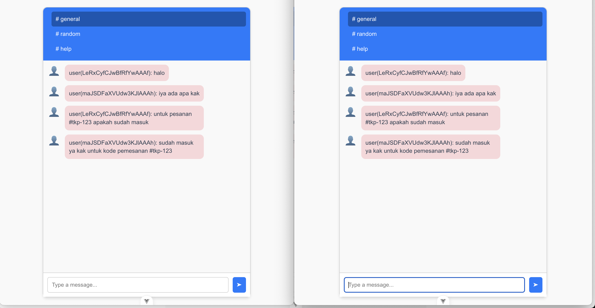

# screening-question-archipelago

## Database Question

1.⁠ ⁠Write a SQL query that shows me how many customers there are from Germany. \
Answer:

```sql
SELECT COUNT(*) as TotalCustomers, Country FROM Customers WHERE Country='Germany' Group by Country;
```

2.⁠ ⁠Write a query that shows me a list of the countries that have the most customers; from most
customers to least customers. Don’t show countries that have less than 5 customers. \
Answer:

```sql
SELECT COUNT(*) AS TotalCustomers, Country
FROM Customers
GROUP BY Country
HAVING COUNT(*) >= 5
ORDER BY COUNT(*) DESC;
```

3.⁠ ⁠Reverse Engineer These Results (tell me the query that we need to write to get these results): \
Answer:

```sql
SELECT
c.CustomerName,
COUNT(o.OrderID) AS OrderCount,
FORMAT(MIN(o.OrderDate), 'yyyy-MM-dd') AS FirstOrder,
FORMAT(MAX(o.OrderDate), 'yyyy-MM-dd') AS LastOrder
FROM
Customers c
INNER JOIN
Orders o
ON
c.CustomerID = o.CustomerID
GROUP BY
c.CustomerName
HAVING COUNT(o.OrderID) >= 5
ORDER BY
MAX(o.OrderDate) DESC;
```

## JS Question

1. Make a javascript or typescript function that converts any string to Title Case.

```js
const message = "SHORT AND STOUT"; // Try edit me

formattedMessage = toTitleCase(message);
function toTitleCase(inputStr) {
  return inputStr
    .toLowerCase()
    .split(" ")
    .map((char) => char.at(0).toUpperCase() + char.slice(1))
    .join(" ");
}

// Update header text
document.querySelector("#header").innerHTML = formattedMessage;

// Log to console
console.log(message);
```

2. Fix this code, using promises

```js
function delay(ms) {
  // add promise code here
  return new Promise((resolve) => {
    setTimeout(resolve, ms);
  });
}
delay(3000).then(() => alert("runs after 3 seconds"));
```

3. Rewrite using Async/Await:

```js
function fetchData(url) {
  return new Promise((resolve, reject) => {
    setTimeout(() => {
      if (!url) {
        reject("URL is required");
      } else {
        resolve(`Data from ${url}`);
      }
    }, 1000);
  });
}

function processData(data) {
  return new Promise((resolve, reject) => {
    if (!data) {
      reject("Data is required");
    } else {
      resolve(data.toUpperCase());
    }
  });
}

async function main() {
  try {
    const data = await fetchData("https://example.com");

    try {
      const processedData = await processData(data);
      console.log("Processed Data:", processedData);
    } catch {
      console.error("Process Error:", err);
    }
  } catch {
    console.error("Fetch Error", err);
  }
}

main();
```

4. Create chat apps

   > Screenshoot from 2 window chat with channel
   > 

   Demo: [AWS-Demo-Link](http://52.77.230.80:5173/)

   Source: \
   backend: [websocket-app](https://github.com/Harisalghifary/simple-websocket) \
   frontend: [chat-app](https://github.com/Harisalghifary/chat-app)

## Vue

1. Explain Vue.js reactivity and common issues when tracking changes \
   Answer:

```text
a. Vue.js reactivity is track the dependencies using reactive system. Reactive props (reactive, ref, etc) changes will update the DOM.
b. Common issues when tracking changes is direct mutate arrays, deeply nested object
```

2. Describe data flow between components in a Vue.js app \n
   Answer:

```text
1. Parent to Child: Use props to pass data.
2. Child to Parent: Emit custom events using $emit.
3. Dependency Injection: Inject and provide for deep component.
4. Sibling Components: Share state using Vuex, Pinia, or an event bus.

```

3. List the most common cause of memory leaks in Vue.js apps and how they can be solved. \
   Answer:

```text
1. Unremove Event Listener
   solution : Clean up in beforeDestroy/onUnmounted
2. Unclosed Reactive Ref
   solution : Manually clean up or use smaller scopes
3. Let Timers/Intervals running
   solution: Clear them in lifecycle hooks
```

4. What have you used for state management \
   Answer:

```text
Vuex, props, and events
```

5. What’s the difference between pre-rendering and server side rendering? \
   Answer:

```text
Pre-rendering: static load html in build time. good for static pages like company profile
Server-side rendering: html rendered on server in each request. good for SEO and dynamic contenct
```

## Web Security

Tell me all the security best practices you can think of - start with the most important ones first. \
Answer:

1. Using HTTPS
2. Secure apps: \
   a. Sanitize and validate input \
   b. Encrypted privacy and importand data (password, user PII, etc)
3. Strong Password
4. Implement Auth and Access Control
5. Secure API
6. Update Software (library, plugins, framework)
7. Rate Limiter
8. Avoid Harcoded Secret

## Website Performance Best Practises

Tell me all the performance best practices you can think of - start with the most important ones first. \
Answer:

1. Database and API Optimization
2. Implement cache (backend and frontend)
3. Use CDN
4. Images Optimization
5. Compress Assets
6. Implement Lazy Loading
7. Reduce Server Response Time

## Golang

Create a function that counts the word frequency in this string "Four, One two two three Three three four four four". Case insensitive, ignore punctuation.

```go
package main

import (
	"fmt"
	"regexp"
	"strings"
)

func countWordFrequency(s string) map[string]int {
	tempStr := strings.ToLower(s)
	// sanitize the input
	re := regexp.MustCompile(`[^a-z0-9\s]`)
	tempStr = re.ReplaceAllString(tempStr, "")

	words := strings.Fields(tempStr)
	wordFreq := make(map[string]int)

	for _, w := range words {
		wordFreq[w]++
	}

	return wordFreq

}

func main() {

	inputStr := "Four, One two two three Three three four  four   four"
	res := countWordFrequency(inputStr)

	for word, count := range res {
		fmt.Printf("%s => %d\n", word, count)
	}

	return
}

```

## Rate Tools

- Git 4
- Redis 4
- VSCode / JetBrains? 5 / 1
- Linux? 4
- AWS 4
  - EC2 4
  - Lambda 2
  - RDS 4
  - Cloudwatch 1
  - S3 4
- Unit testing 4
- Kanban boards 4
